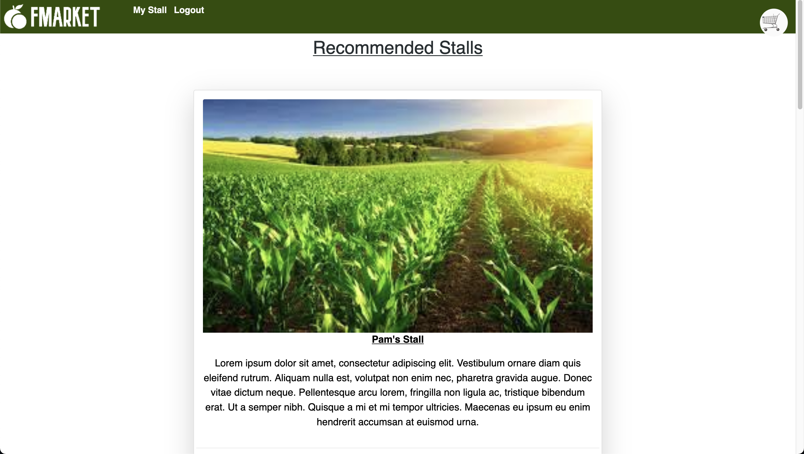
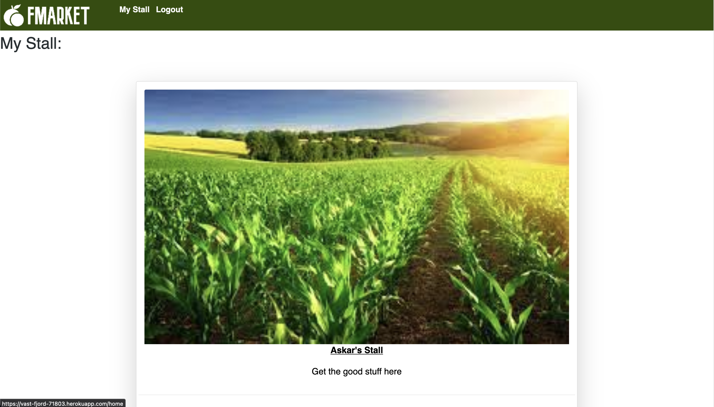
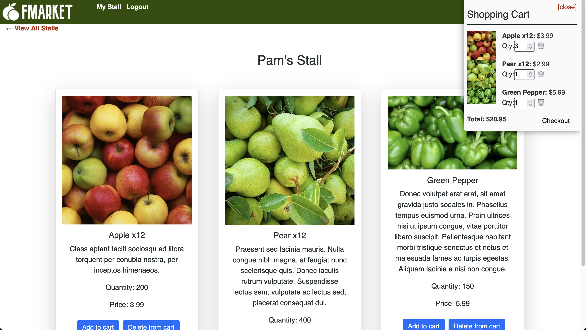

# Askar's Portfolio in React

  

  ## Description
  Our final project is a React and React-Redux app that provides a digital marketplace for farmers to sell their produce. The project uses many technologies including
  React, MongooseDB, jsonwebtoken, Bootstrap, GraphQL, Stripe, Redux, Apollo Server and Express. This application allows a user to create an account and purchase items
  from sellers. The checkout process is done through Stripe and each seller has their own unique cart that's separate from other sellers. A user can also open their
  own "stall" to sell their products to other users.

  ## Table of Contents

* [Installation](#installation)
* [Usage](#usage)
* [License](#license)
* [Deployment](#deployment)
* [Questions](#questions)

## Installation
1: Clone the repository from Github 2:  Run NPM Install to install the modules 3:  Run "npm run develop" to start the application 4:  Access the website at http://localhost:3000/ or https://vast-fjord-71803.herokuapp.com 

## Usage

## License
https://opensource.org/licenses/MPL-2.0  
Licensed under Mozilla Public License 2.0

## Deployment
https://vast-fjord-71803.herokuapp.com

## Questions
Askar Rizvi:  
https://github.com/askarrizvi  
Charlie Rick:  
https://github.com/Cdjrick  
Thomas Habtemariam:  
https://github.com/tomhabt
